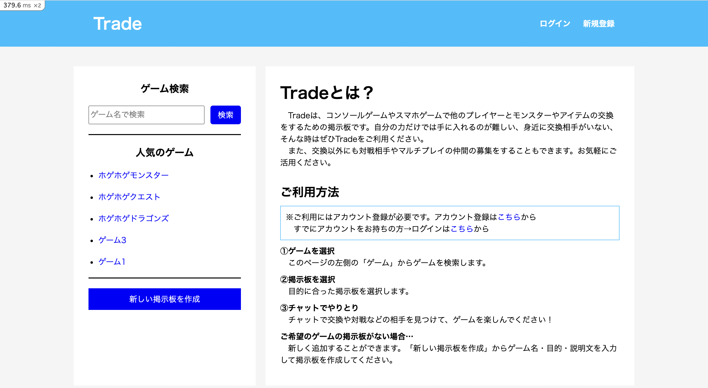
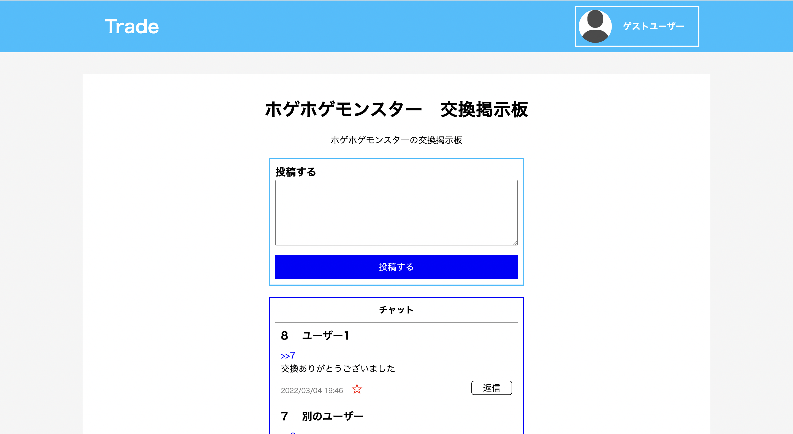
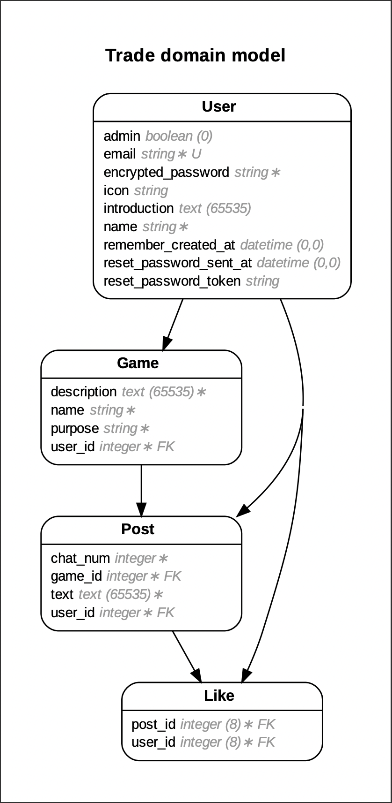

# Trade

## 概要

Tradeは、コンソールゲームやスマホゲームで他のプレイヤーとモンスターやアイテムの交換をしたり、対戦相手の募集をするための掲示板です。

アイテムを自分の力だけでは手に入れるのが難しい時や、身近に交換相手がいない時、また、ゲームにランダムマッチング機能がない場合などに利用できます。チャット機能を用いて、交換や対戦の相手を見つけることができます。

## 使い方

__1. アカウント登録__

ユーザー名・メールアドレス・パスワードを入力することで、アカウントを作成することができます。

ログインページ内の「ゲストユーザーでログイン」をクリックすると、アカウント登録せずにログインすることができます。（ゲストログイン）

__2. 掲示板を作成__

ゲーム名・掲示板の用途・掲示板の説明を入力して掲示板を作成することができます。

利用したい掲示板がすでに存在する場合は、その掲示板を使用できます。

__3. チャットを投稿__

チャットで交換や対戦などの相手を見つけて、ゲームを楽しんでください！

## デモ画像

* トップページ

* チャットページ

## 開発環境

Dockerコンテナ内で開発

ホストOS: MacOS

Rails: 6.1.4.4

Ruby: 3.0.3

MySQL: 8.0

使用言語→HTML, CSS, JavaScript, Ruby, SQL

## テスト

RSpecを用いてテスト

リンターとしてRubocopを使用

CircleCIでRSpecとRubocopを自動化

## 本番環境

Herokuにデプロイ

データベースにはJawsDB(MySQL)を使用

アップロードされた画像はAWSのS3に保存

ウェブサイトはこちらから→[Trade](https://portfolio-app-trade.herokuapp.com/)

## ER図

Likeモデルでは、どのユーザー（User）がどのチャット（Post）にいいねしたかを管理しています。

## ポートフォリオ制作について

### 特に力を入れた点

__・環境構築__

Docker関連のファイルやCircleCIの設定ファイルを作成するために、インターネットで複数のサイトを調べました。何度もエラーに直面しましたが、粘り強く調べることで解決することができました。

また、RSpec、特にSystemSpec(Capybara)の設定に関して深く調べました。Docker環境ということもあり少し複雑でしたが、エラーの原因を調べて解決し、最終的にはテストが行えるようになりました。

__・RSpecテスト__

ModelSpec, RequestSpec, SystemSpecをそれぞれ丁寧に記述しました。SystemSpecでは、考えられ得る状況を全てテストすることを心掛けました。

また、同じ内容を複数回記述するのを避けるため、FactoryBotを用いてテストデータを定義する・特定の処理をモジュールに切り出すなどして、テストコードが見やすくなるように努めました。

__・チャット返信機能__

チャットの返信をしやすくするために、「返信」をクリックすると、自動でテキストエリア内に「>> + 返信先の番号」が入力されるようにしました。インターネットで複数のサイトを調べ、JavaScript・jQueryを用いて実装を試みました。その結果、最終的には目的の実装ができました。

また、チャット本文中の「>> + 返信先の番号」の部分だけをリンク化する処理の実装にも力を入れました。チャットの番号をPostモデルのtextカラムとは別のカラムに保存することも考えましたが、調べ続けていく中で、チャット本文（textカラム）の文字列を分割する方法にたどり着けました。

### 反省点

cssファイルの記述をBootstrapを用いて行えばよかったと思っています。Bootstrapを用いていれば、class名の命名やスタイルの記述をもっと簡単に行えたと思います。
